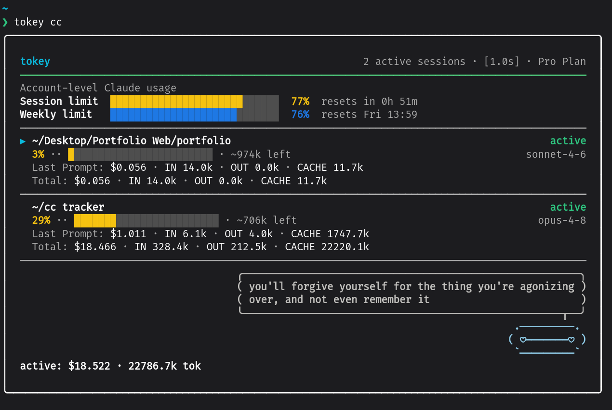

# Tokey

A tiny live panel that shows what each Claude Code prompt actually costs, in
tokens and in dollars. I built it because the built-in statusline tells you how
full your context is but never what the last turn spent, and that per-prompt
number is the thing I kept wanting to see.



## What it shows

One compact block per Claude Code session from the last 7 days, newest first.
Every block stacks the same shape, so a newly-started session just adds another
block within a refresh (no restart). Each block is:

- a **header line**: the project name and the session's liveness (`active`, or
  `closing` as it winds down), with `▶` marking the session tokey is
  auto-following (the most recently active one).
- **Context**: `NN% ·· bar · ~Nk left`, an estimate of how full the window is,
  derived from the last prompt's token figures (input plus cache read plus
  cache creation). Treat it as a gauge rather than an exact meter; an estimate
  that overflows the window renders like `104%?` instead of clamping to a clean
  100%, and a model the limit table does not know shows `context limit unknown`.
  The model the window belongs to is shown right-aligned on this line (e.g.
  `opus-4-8`), so you can see which model's limit the percentage is against.
- **Last Prompt**: the session's most recent turn, broken into IN (input plus
  cache creation), OUT, CACHE (cache read, shown only when the turn read cache),
  and the turn's dollar cost. This updates in real time *while a prompt runs* —
  the in-flight turn's figures climb as the response streams, not only once it
  finishes. An unpriceable model shows `$?`; a session that has not produced a
  turn yet shows `no completed turn yet`.
- **Total**: the same breakdown totalled across the whole session (every turn's
  IN / OUT / CACHE and dollars). A `+` on the dollar figure (`$1.234+`) flags a
  partial total when the session contains a turn that could not be priced.

With more than 10 live sessions the newest 10 render and a "+N more" line counts
the rest. A footer shows the active total, `active: $X · Nk tok`, summed over the
sessions currently active (the same scope as the header's active count); a
`(+ unpriced)` flag appears whenever any of them contains turns that could not
be priced.

The footer also carries a little companion: a soft light-blue Baymax who emotes
through his eyes, with a white comic-style speech bubble above him showing a
rotating one-line reflection. His mood and the line are paired, so they change
together every several seconds and never fall out of step (read from transcript
write-recency, so it adds no work); a small spinner trails him while a prompt is
streaming. Pass `--no-mood` to hide him and keep the plain `active: $X · Nk tok`
line.

Each turn is priced with its own model before summing, so sessions that mix
models add up correctly.

The Last Prompt figure is the one I watch: it tells me which prompts are
expensive while I can still change how I am asking, instead of finding out at
the end.

## Requirements

- Python 3.11+
- Claude Code

## Install

**On Windows?** Skip this section — see [Windows quick start](#windows-quick-start-no-terminal-no-path)
below for a two-click setup that needs no terminal and no PATH.

Clone the repo, then from inside it:

    pip install -e .

This installs two commands on your PATH: `tokey` (the panel) and `tokey-hook`
(the optional session hook below). Tokey auto-detects your active Claude Code
session by reading the most recently modified transcript under
`~/.claude/projects`. No configuration needed.

If `tokey` is not found after install, your `~/.local/bin` is not on your
PATH. Add it (e.g. `export PATH="$HOME/.local/bin:$PATH"` in your shell rc) and
reopen the terminal.

## Windows quick start (no terminal, no PATH)

Tokey ships two double-click launchers for Windows, so setup is two clicks and
you never type a command or touch PATH:

1. **Get the code.** On the GitHub page click *Code → Download ZIP*, then
   right-click the downloaded file → *Extract All*.
2. **Double-click `setup.bat`.** It checks you have Python 3.11+ (and points you
   to the installer if you don't), then installs tokey. Wait for *Done!*, then
   press a key to close the window.
3. **Double-click `run-tokey.bat`.** The panel opens in its own window — set it
   beside your Claude Code window. Press Ctrl-C to quit.

That's the whole setup. To also show account-level usage, open a terminal in the
folder and run `py -m cc_token_tracker.roster cc` (see *Account-level usage*
below). Everything past here is optional or for troubleshooting.

### Troubleshooting: `tokey` "not recognized" in a terminal

The launchers above avoid this entirely. It only bites if you skip them and call
the bare `tokey` command in a terminal: pip put `tokey.exe` in your Python
`Scripts` directory and that directory is not on your PATH. The no-PATH way to
run is always `py -m cc_token_tracker.roster` — the same command `run-tokey.bat`
uses. (The `-m` form must use the *same* interpreter where you installed; a venv's
own `py` / `python` is the only one that can import `cc_token_tracker`.)

If you do want the bare `tokey` command, add `Scripts` to PATH through the GUI
editor: press Win+R, run `sysdm.cpl`, go to *Advanced → Environment Variables*,
select `Path`, then *Edit → New* and add your Python `Scripts` directory as its
own entry. Reopen the terminal.

Do NOT run `setx PATH "%PATH%;C:\...\Scripts"`. `setx` re-expands `%PATH%`, can
fuse your user and system PATH together, and silently truncates anything past
its length limit; it corrupted a real PATH during testing here. Always edit PATH
through the GUI editor above.

## Run it

Open a second terminal pane next to Claude Code and run:

    tokey

The panel updates once a second. Keep Claude Code in one pane, the tracker in
the other. That two-pane setup is the intended way to use it.

To also show your subscription Session/Weekly usage, run `tokey cc` instead (see
*Account-level usage* below).

Press Ctrl-C to quit the panel.

## Live session tracking (optional)

By default a session's liveness is inferred from its transcript file's
modification time, which has two rough edges: a brand-new session does not show
until its first prompt creates the transcript, and a session you have exited
keeps reading `active` for several minutes (an idle-but-open session and a
closed one look identical on disk).

Installing a pair of Claude Code hooks fixes both: a session appears the instant
it opens (before the first prompt) and disappears the instant you exit it. Add
these to your `~/.claude/settings.json` (the `tokey-hook` command is the entry
point `pip install -e .` put on your PATH):

```json
"hooks": {
  "SessionStart": [
    { "hooks": [ { "type": "command", "command": "tokey-hook" } ] }
  ],
  "SessionEnd": [
    { "hooks": [ { "type": "command", "command": "tokey-hook" } ] }
  ]
}
```

The hook writes a tiny per-session marker under `~/.claude/cc_token_tracker/`
and never prints or blocks. Without the hooks, tokey falls back to the
transcript-mtime behavior, so this is purely an upgrade — nothing breaks if you
skip it (and Claude Code on Windows, which does not run all hooks the same way,
just keeps the fallback).

## Account-level usage (optional)

Tokey's per-session blocks answer "what did this prompt cost". This optional
feature adds the companion question "how much of my plan allowance is left": the
same Session (5-hour) and Weekly windows the claude.ai Usage panel and Claude
Code's `/usage` show, as a block above the sessions, plus a plan badge in the
header:

```
Account-level Claude usage
Session limit  ████░░░░░░░░░░░░░░░░░░░░░░░░░░  15%  resets in 4h 20m
Weekly limit   ███████░░░░░░░░░░░░░░░░░░░░░░░  25%  resets Fri 13:59
```

It is **off by default**. Turn it on by launching the panel with the `cc`
subcommand:

    tokey cc

(For scripts or cron, setting `TOKEY_ACCOUNT_USAGE=1` does the same thing.)

These windows are an opaque server-side **percentage**, not dollars: there is no
dollar cap on a subscription, so tokey shows the percent and reset time only.
(Real dollars appear in one place: the usage-credits add-on, shown only if you
have enabled it.) The bar is tinted by how close you are to the cap — green,
then yellow past 50%, red past 80%.

**How it works.** Tokey reads the OAuth token Claude Code already stored in
`~/.claude/.credentials.json` and sends it only to `api.anthropic.com` — the
same destination Claude Code uses. The token never reaches any third party and
tokey never writes to your credentials file. The lookup runs off the render
path and refreshes every few minutes (the endpoint rate-limits aggressively and
the windows barely move minute to minute). If a fetch fails the block shows
`Account-level usage: unavailable` and retries on the next refresh; the rest of
the panel is unaffected. The endpoint is undocumented and may change.

