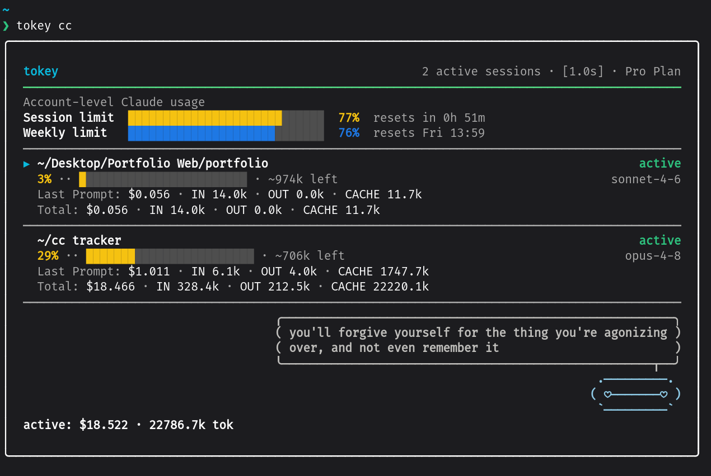

# Tokey

A tiny live panel that shows what each Claude Code prompt actually costs, in
tokens and in dollars. I built it because the built-in statusline tells you how
full your context is but never what the last turn spent, and that per-prompt
number is the thing I kept wanting to see.



## What it shows

The top line shows **today's spend**: every session you wrote to since local
midnight, live, including ones that have already closed. Below it, one compact
block per Claude Code session from the last 7 days, newest first. Every block
stacks the same shape, so a newly-started session just adds another block
within a refresh (no restart). Each block is:

- a **header line**: the project name and the session's liveness (`active`, or
  `closing` as it winds down), with `▶` marking the session tokey is
  auto-following (the most recently active one).
- **Context**: `NN% ·· bar · ~723.6k left`, an estimate of how full the window is,
  derived from the last prompt's token figures (input plus cache read plus
  cache creation). Treat it as a gauge rather than an exact meter; an estimate
  that overflows the window renders like `104%?` instead of clamping to a clean
  100%, and a model the limit table does not know shows `context limit unknown`.
  The model the window belongs to is shown right-aligned on this line (e.g.
  `opus-4-8`), so you can see which model's limit the percentage is against.
- **Last Prompt**: the session's most recent turn, broken into IN (uncached
  input), OUT, and CACHE split into `W` (cache write) and `R` (cache read), plus
  the turn's dollar cost, e.g. `$2.529 · IN 50 · OUT 35.2k · CACHE W 74.2k
  R 6.2M`. Writes and reads are kept apart because they bill very differently
  (a 1-hour cache write costs 2x input, a read 0.1x or less), so the huge read
  count is usually the cheap part. A zero side is left out. This updates in real time *while a prompt runs*:
  the in-flight turn's figures climb as the response streams, not only once it
  finishes. An unpriceable model shows `$?`; a session that has not produced a
  turn yet shows `no completed turn yet`.
- **Total**: the same breakdown totalled across the whole session (every turn's
  IN / OUT / CACHE and dollars). Token counts scale their unit (`900`,
  `74.2k`, `13.5M`) everywhere, the history screen included. A `+` on the dollar figure (`$1.234+`) flags a
  partial total when the session contains a turn that could not be priced.

With more than 10 live sessions the newest 10 render and a "+N more" line counts
the rest. A footer shows the active total, `active: $X · Nk tok`, summed over the
sessions currently active (the same scope as the header's active count); a
`(+ unpriced)` flag appears whenever any of them contains turns that could not
be priced.

The footer also carries a little companion: a soft light-blue Baymax who emotes
through his eyes, with a white comic-style speech bubble above him showing a
rotating one-line reflection. He steps aside on his own when the terminal is
too short to fit him and your sessions, so a small tmux pane shows sessions
first. His mood and the line are paired, so they change
together every several seconds and never fall out of step (read from transcript
write-recency, so it adds no work); a small spinner trails him while a prompt is
streaming. Pass `--no-mood` to hide him and keep the plain `active: $X · Nk tok`
line.

Each turn is priced with its own model before summing, so sessions that mix
models add up correctly.

The Last Prompt figure is the one I watch: it tells me which prompts are
expensive while I can still change how I am asking, instead of finding out at
the end.

## Spend history (`tokey log`)

The panel above is live: it only ever sees the last 7 days of transcripts, and
Claude Code eventually rotates those away. So `tokey` also keeps a small
history of its own, and `tokey log` reads it back:

```
  last 26 active days

  day          sessions   tokens      cost
  ───────────────────────────────────────────────────────────────
  2026-09-24          3    29.8M    $15.63   ██
  2026-09-23          2    67.1M    $30.96   █████
  2026-09-07         20   114.9M   $132.17   ████████████████████

  by month

  month     sessions   tokens      cost
  ─────────────────────────────────────
  2026-09        132   943.6M   $748.55
  2026-08          6    32.5M    $30.61

  by project (all time)

  project         sessions   tokens      cost
  ───────────────────────────────────────────
  Mood Palette          91   726.5M   $596.94
  cc tracker             3    32.0M    $22.17
  (temp dirs)           15    41.3k     $0.09

  all time  ·  138 sessions  ·  $779.16
```

Projects are grouped by repository: sessions run in a git worktree (T3 Code's
`~/.t3/worktrees/<repo>/…`, `<repo>-worktrees/…`, or Claude Code's
`<repo>/.claude/worktrees/…`) count toward the repo they came from, and
throwaway sessions in the system temp dir share one `(temp dirs)` row.

One row per finished session, in a SQLite database at
`~/.claude/tokey/history.db` (stdlib `sqlite3`, so still no new dependency).
The `+` carries the same meaning it does in the panel: the total covers the
priceable turns only, because something in that span used a model the pricing
table does not know.

Sessions are recorded when they end, by the same `tokey-hook` used for live
tracking below, so history keeps accruing on days you never open the panel. A
session that dies without a clean exit (a crash, `kill -9`, a closed terminal)
never fires that hook, so `tokey` also backfills every transcript still on disk
when it starts (in the background, so the panel is not delayed). Writing twice is harmless: both paths key on the session id.

## Requirements

- Python 3.11+
- Claude Code

## Install

**On Windows?** Skip this section, see [Windows quick start](#windows-quick-start-no-terminal-no-path)
below for a two-click setup that needs no terminal and no PATH.

Clone the repo, then from inside it:

    pip install -e .

This installs two commands on your PATH: `tokey` (the panel) and `tokey-hook`
(the optional session hook below). Tokey auto-detects your active Claude Code
session by reading the most recently modified transcript under
`~/.claude/projects`. No configuration needed.

If `tokey` is not found after install, your `~/.local/bin` is not on your
PATH. Add it (e.g. `export PATH="$HOME/.local/bin:$PATH"` in your shell rc) and
reopen the terminal.

## Windows quick start (no terminal, no PATH)

Setup is two clicks, and you never type a command or touch PATH:

1. **Get the code.** On the GitHub page click *Code → Download ZIP*, then
   right-click the downloaded file → *Extract All*.
2. **Double-click `setup.bat`.** It checks you have Python 3.11+ (and points you
   to the installer if you don't), installs tokey, and puts a **Tokey** launcher
   on your Desktop. Wait for *Done!*, then press a key to close the window.
3. **Double-click the `Tokey` launcher on your Desktop.** The panel opens in its
   own window; set it beside your Claude Code window. Press Ctrl-C to quit.

That's the whole setup. The install copies tokey into Python, so you can delete
the downloaded folder and still launch from the Desktop. Everything past here is
optional or for troubleshooting.

### Troubleshooting: `tokey` "not recognized" in a terminal

The launchers avoid this; it only bites if you skip them and call the bare
`tokey` in a terminal, where pip's `Scripts` directory may not be on your PATH.
The no-PATH way to run is always `py -m cc_token_tracker.roster`.

To get the bare `tokey` command, add your Python `Scripts` directory to PATH via
the GUI editor (Win+R → `sysdm.cpl` → *Advanced → Environment Variables* → select
`Path` → *Edit → New*), then reopen the terminal. Do **not** use
`setx PATH "%PATH%;..."`: it re-expands `%PATH%`, can fuse user and system PATH
together, and silently truncates past its length limit (it corrupted a real PATH
during testing here).

## Run it

Open a second terminal pane next to Claude Code and run:

    tokey

The panel updates once a second. Keep Claude Code in one pane, the tracker in
the other. That two-pane setup is the intended way to use it.

To also show your subscription Session/Weekly usage, run `tokey cc` instead (see
*Account-level usage* below).

Press Ctrl-C to quit the panel.

## Live session tracking (optional)

By default a session's liveness is inferred from its transcript file's
modification time, which has two rough edges: a brand-new session does not show
until its first prompt creates the transcript, and a session you have exited
keeps reading `active` for several minutes (an idle-but-open session and a
closed one look identical on disk).

Installing a pair of Claude Code hooks fixes both: a session appears the instant
it opens (before the first prompt) and disappears the instant you exit it. Add
these to your `~/.claude/settings.json` (the `tokey-hook` command is the entry
point `pip install -e .` put on your PATH):

```json
"hooks": {
  "SessionStart": [
    { "hooks": [ { "type": "command", "command": "tokey-hook" } ] }
  ],
  "SessionEnd": [
    { "hooks": [ { "type": "command", "command": "tokey-hook" } ] }
  ]
}
```

The hook writes a tiny per-session marker under `~/.claude/cc_token_tracker/`
and never prints or blocks. Without the hooks, tokey falls back to the
transcript-mtime behavior, so this is purely an upgrade; nothing breaks if you
skip it (and Claude Code on Windows, which does not run all hooks the same way,
just keeps the fallback).

## Account-level usage (optional)

Tokey's per-session blocks answer "what did this prompt cost". This optional
feature adds the companion question "how much of my plan allowance is left": the
same Session (5-hour) and Weekly windows the claude.ai Usage panel and Claude
Code's `/usage` show, as a block above the sessions, plus a plan badge in the
header:

```
Account-level Claude usage
Session limit  ████░░░░░░░░░░░░░░░░░░░░░░░░░░  15%  resets in 4h 20m
Weekly limit   ███████░░░░░░░░░░░░░░░░░░░░░░░  25%  resets Fri 13:59
```

It is **off by default**. Turn it on by launching the panel with the `cc`
subcommand:

    tokey cc

(For scripts or cron, setting `TOKEY_ACCOUNT_USAGE=1` does the same thing.)

These windows are an opaque server-side **percentage**, not dollars: there is no
dollar cap on a subscription, so tokey shows the percent and reset time only.
(Real dollars appear in one place: the usage-credits add-on, shown only if you
have enabled it.) Each row has its own fixed colour, so stacked bars stay
readable as separate gauges rather than merging into one block.

**How it works.** Tokey reads the OAuth token Claude Code already stored (the
plaintext `~/.claude/.credentials.json` on Linux/WSL, or the login Keychain on
macOS, where Claude Code keeps it instead of the file) and sends it only to
`api.anthropic.com`, the same destination Claude Code uses. The token never
reaches any third party and tokey never writes to your credential store. The
macOS lookup shells out to the built-in `security` tool, read-only, so nothing
else is needed. The lookup runs off the render
path and refreshes every few minutes (the endpoint rate-limits aggressively and
the windows barely move minute to minute). If a fetch fails the block shows
`Account-level usage: unavailable` and retries on the next refresh; the rest of
the panel is unaffected. The endpoint is undocumented and may change.

